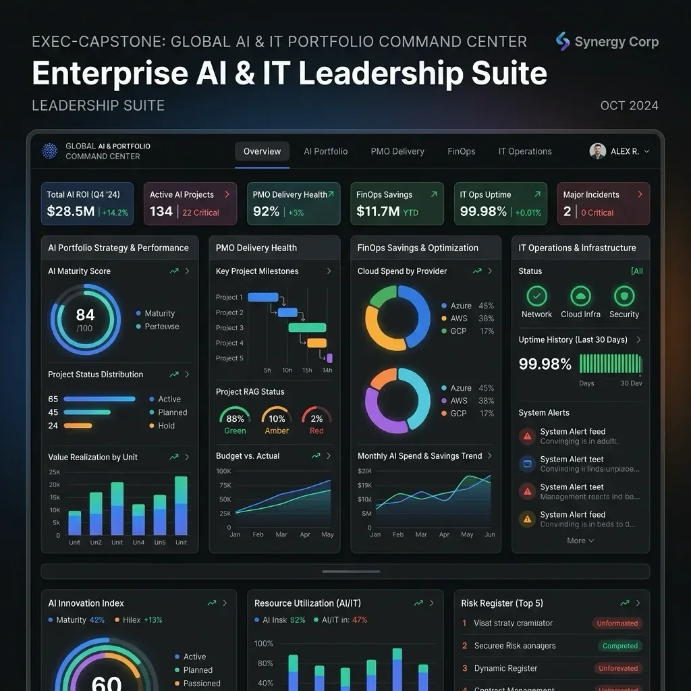
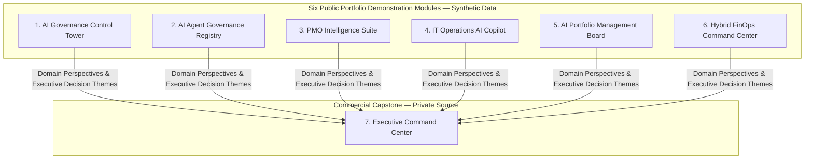
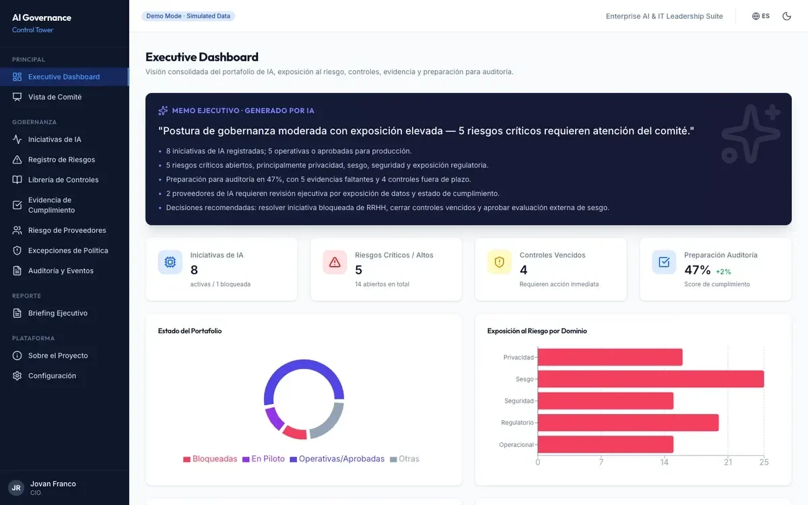
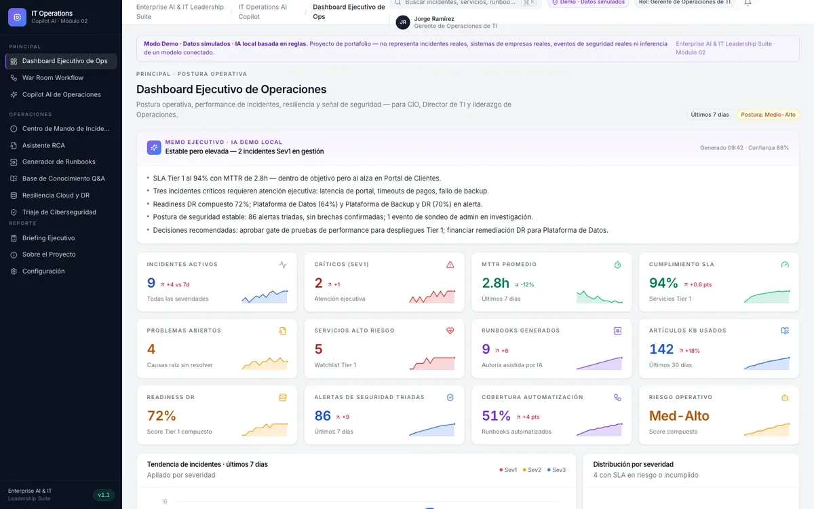
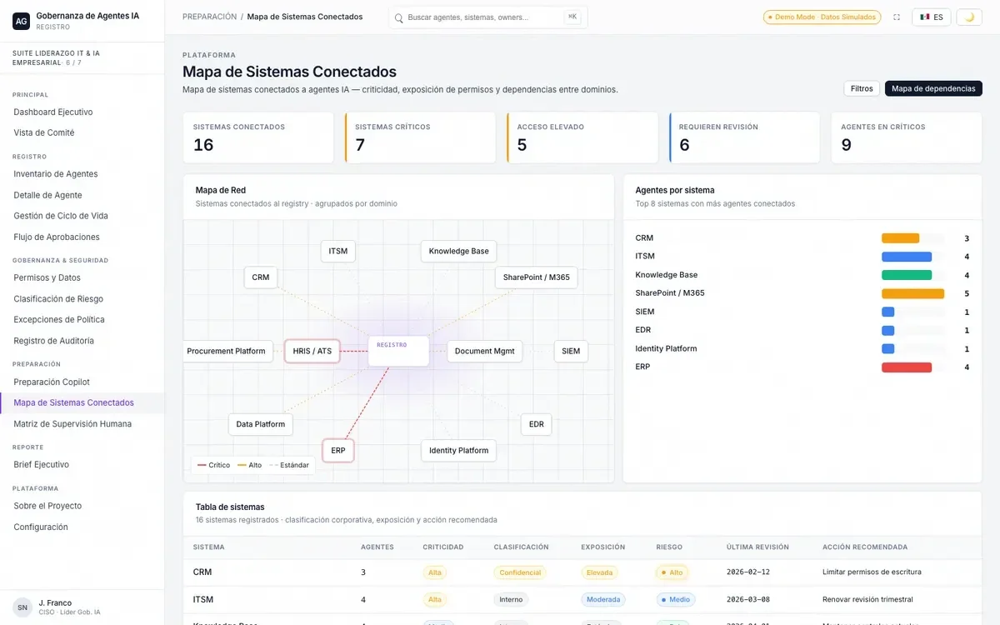
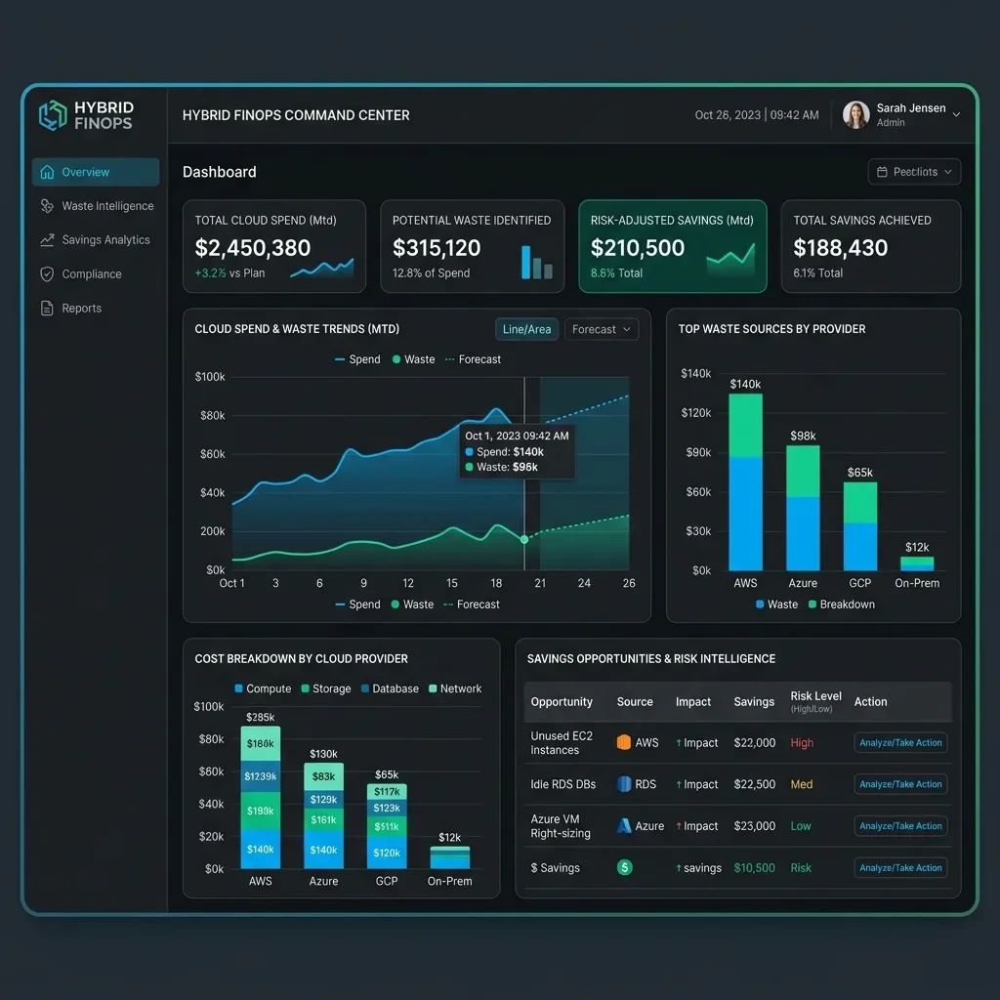

# Executive AI & IT Leadership Suite

  

  <strong>Executive decision-support portfolio across AI governance, agent oversight, PMO, IT operations, AI investment and hybrid FinOps.</strong> 
  Six public demonstrations connected by the operating model of Executive Command Center.

  <a href="https://github.com/jovfranco-tech"><strong>Jovan Franco — GitHub Profile</strong></a> •
  <a href="https://www.jovanfranco.com"><strong>Website & Executive Insights</strong></a> •
  <a href="https://executive-command-center-one.vercel.app/"><strong>Executive Command Center Landing</strong></a>

---

## Executive Portfolio Snapshot

| Decision domain | Portfolio demonstration | Primary executive question |
| :--- | :--- | :--- |
| **AI governance** | [AI Governance Control Tower](https://ai-governance-control-tower.vercel.app/) | Which AI initiatives require stronger controls, evidence or human oversight? |
| **Agent governance** | [AI Agent Governance Registry](https://ai-governance-registry.vercel.app/) | Who owns each agent, what can it access and where must a human approve? |
| **Transformation delivery** | [PMO Intelligence Suite](https://pmo-intelligence-suite.vercel.app/) | Which programs are drifting, blocked or consuming capacity without progress? |
| **Technology operations** | [IT Operations AI Copilot](https://it-operations-ai-copilot.vercel.app/) | Which incidents and resilience gaps require immediate leadership attention? |
| **AI portfolio investment** | [AI Portfolio Management Board](https://ai-portfolio-management-board.vercel.app/) | Which AI initiatives best align investment, risk and expected value? |
| **Hybrid infrastructure economics** | [Hybrid FinOps Command Center](https://hybrid-finops-cc.vercel.app/dashboard) | Where is recoverable waste concentrated across cloud, virtualization and licenses? |

### What this portfolio demonstrates

- Translation of complex technology signals into executive decisions.
- Governance models with explicit ownership, controls, evidence and human authority.
- Product thinking across risk, operations, finance, PMO and investment portfolios.
- Interactive systems built to communicate architecture and operating models clearly.
- Responsible portfolio boundaries using synthetic data and explicit maturity labels.

---

## Architecture & Operating Model

The **Executive AI & IT Leadership Suite** bridges domain-specific operational tools and C-suite decision support. Six specialized public portfolio demonstrations provide focused visibility into AI risk, agent autonomy, PMO delivery, SecOps triage, AI portfolio alignment and cloud FinOps.

The six demonstrations illustrate perspectives consolidated within the **Executive Command Center** operating model—an integrated, private-source commercial decision-support platform for alignment across technology risk, operations, finance and strategy.

> [!NOTE]
> **Conceptual domain consolidation:** The six public demonstrations operate independently with synthetic dataset fixtures. The diagram represents conceptual and operating-model alignment, not active production integrations, shared live databases or streaming telemetry pipelines.

---

## Six Public Portfolio Demonstration Modules

### Module 1: AI Governance Control Tower

  

- **Live Interactive Demo**: **[Open AI Governance Control Tower](https://ai-governance-control-tower.vercel.app/)**
- **Business Problem**: Enterprise difficulty in systematically scoring AI use-case risk, mapping controls, tracking policy exceptions and preparing for governance audits.
- **Intended Audience**: Chief AI Officers, Chief Risk Officers and Enterprise Risk Committees.
- **Verified Capabilities**: ISO/IEC 42001-inspired intake scoring, risk tiering, policy exception tracking, third-party vendor risk scorecards and audit-ready evidence ledgers.
- **Product Maturity**: Portfolio Prototype — ISO/IEC 42001-inspired functional scope.
- **Synthetic Data Scope**: Representative synthetic data; no real tenant metrics or guaranteed statutory compliance.

---

### Module 2: AI Agent Governance Registry

  

- **Live Interactive Demo**: **[Open AI Agent Governance Registry](https://ai-governance-registry.vercel.app/)**
- **Business Problem**: Proliferation of autonomous AI agents, tool-calling permissions and insufficient human oversight gates.
- **Intended Audience**: CISOs, AI Platform Architects and IT Governance Directors.
- **Verified Capabilities**: Agent inventory, permission boundaries, risk classification, lifecycle state transitions and escalation logs.
- **Product Maturity**: Portfolio Prototype — Agent Risk Framework.
- **Synthetic Data Scope**: Synthetic agent configurations and browser-local state; no live enterprise IAM enforcement.

---

### Module 3: PMO Intelligence Suite

  

- **Live Interactive Demo**: **[Open PMO Intelligence Suite](https://pmo-intelligence-suite.vercel.app/)**
- **Business Problem**: Fragmented visibility across predictive, agile, hybrid and AI/ML project delivery pipelines.
- **Intended Audience**: VPs of PMO, Program Directors and Transformation Leaders.
- **Verified Capabilities**: Milestone velocity scoring, risk indicators, bottleneck identification and cross-project resource allocation.
- **Product Maturity**: Portfolio Demonstration — PMO Risk & Velocity.
- **Synthetic Data Scope**: Simulated project telemetry.

---

### Module 4: IT Operations AI Copilot

  

- **Live Interactive Demo**: **[Open IT Operations AI Copilot](https://it-operations-ai-copilot.vercel.app/)**
- **Business Problem**: Extended incident triage timelines and SecOps operational overload.
- **Intended Audience**: IT Operations Directors, Infrastructure Managers and SecOps Leads.
- **Verified Capabilities**: Incident triage, disaster recovery readiness, operational briefings and context-aware resolution guidance.
- **Product Maturity**: Portfolio Demonstration — SecOps & Incident Triage.
- **Synthetic Data Scope**: Simulated incident logs and infrastructure alerts.

---

### Module 5: AI Portfolio Management Board

  

- **Live Interactive Demo**: **[Open AI Portfolio Management Board](https://ai-portfolio-management-board.vercel.app/)**
- **Business Problem**: Misalignment between strategic enterprise goals and tactical AI initiative funding.
- **Intended Audience**: CIOs, Strategy Directors and Investment Committees.
- **Verified Capabilities**: AI investment prioritization, value-realization tracking, strategic alignment scoring and portfolio balancing.
- **Product Maturity**: Portfolio Demonstration — AI Portfolio Scoring.
- **Synthetic Data Scope**: Representative financial models and synthetic initiative scores.

---

### Module 6: Hybrid FinOps Command Center — Portfolio Demonstration

  

- **Live Interactive Demo**: **[Open Hybrid FinOps Command Center](https://hybrid-finops-cc.vercel.app/dashboard)**
- **Business Problem**: Unidentified waste across hybrid cloud, virtualization, storage and collaboration-license footprints.
- **Intended Audience**: CIOs, FinOps Directors and Cloud Operations Leads.
- **Verified Capabilities**: Cross-domain waste scoring, risk-adjusted recoverable savings, opportunity management and execution-asset generation.
- **Product Maturity**: Portfolio Demonstration — Hybrid Waste Intelligence.
- **Synthetic Data Scope**: Synthetic telemetry exports and browser-local state.

> [!NOTE]
> **FinOps product boundary:** `Hybrid FinOps Command Center — Portfolio Demonstration` is distinct from `Hybrid FinOps Savings Copilot — Commercial Product`, whose source and implementation remain private.

---

## Commercial Capstone: Executive Command Center

  

- **Executive Landing Page**: **[Open Executive Command Center Landing Page](https://executive-command-center-one.vercel.app/)**
- **Commercial Classification**: `PUBLIC_COMMERCIAL_LANDING` • `FULL_APP_PROTECTION_PENDING` • `PRIVATE_COMMERCIAL_SOURCE` • `INTEGRATED_COMMERCIAL_PLATFORM`

**Executive Command Center** is the commercial capstone designed to consolidate decision-support perspectives across the six portfolio domains into one executive interface. It is intended for enterprise CIOs, CAIOs, CISOs and board committees reviewing risk, operational health, financial efficiency and portfolio execution.

### Consolidated perspectives

- **CAIO / Risk Committee**: AI risk posture and ISO/IEC 42001-inspired governance readiness.
- **CIO / Operations Leadership**: Operational health, PMO delivery velocity and hybrid FinOps recovery themes.
- **CISO / Resilience Leadership**: Security posture, vendor risk and incident-readiness concepts.

### Private access and protection boundary

Commercial source code, backend schemas, proprietary scoring heuristics and internal administration or operational routes remain private. Enterprise decision-makers may request a protected demonstration through the official landing page.

---

## Intellectual Property & Responsible Disclosure

© Jovan Franco. All Rights Reserved.  
This repository is provided as a public portfolio showcase and architectural overview. Reproduction, redistribution or commercial use without prior written consent is prohibited.
